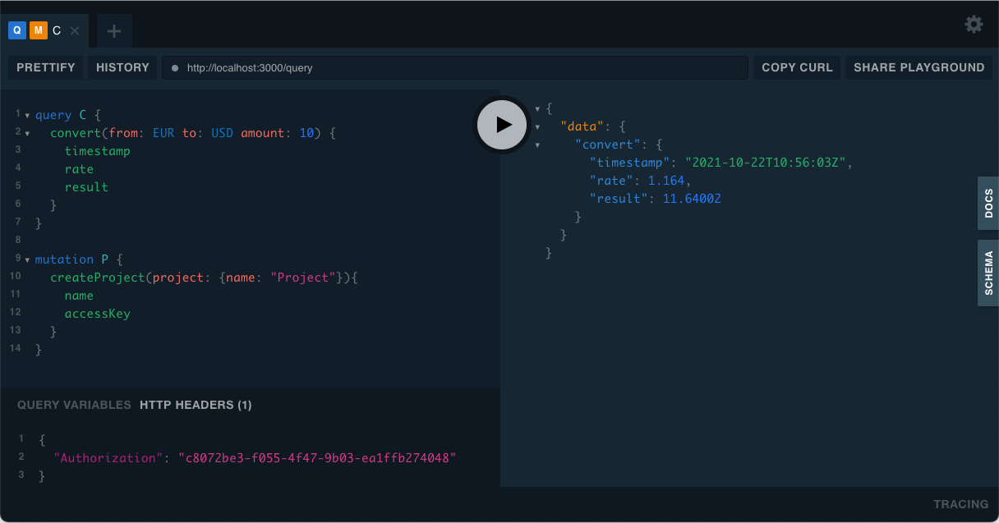

# Currency conversion API

**Currency conversion API** is a GraphQL API that provides a small service converting Euro to US Dollar and vice-versa.

Access to `convert` is protected with Access Key that can be generated by creating a new project:
```
mutation {
  createProject(project: {name: "Project"}){
    name
    accessKey
  }
}
```

To access `convert` query use project's `accessKey` as an `Authorization` header:
```
convert(from: EUR to: USD amount: 10) {
  timestamp
  rate
  result
}
```



### 1. Tech stack

* Golang
* GraphQL
* Docker
* Docker Compose
___

### 2. Dependencies

#### External golang packages
* Go library for building GraphQL servers – https://github.com/99designs/gqlgen
* Structured logger for Go (golang) – https://github.com/sirupsen/logrus
* Go library for UUID generation – https://github.com/google/uuid
#### External services
* Foreign exchange rates and currency conversion JSON API – https://fixer.io
___
### 3. Contribution

Use https://github.com/99designs/gqlgen to get basic knowledge

#### 3.1. Development
1. Do change in `.graphqls` files
2. Run generator to generate new or update code according to new schema
```
$ make regenerate
```
3. Implement resolvers according to your needs

#### 3.2. Running locally
Execute command
```
$ make run
```

Run the playground in browser: http://localhost:3000

#### 3.3. Running Unit Tests
Execute command
```
$ make test
```
___
### 4. Containerized environment

To build a container Docker and Docker-Compose has to be installed:  
* https://docs.docker.com/get-docker/
* https://docs.docker.com/compose/install/

To run an application using `docker-compose` use next command:
```
$ docker-compose up
```
Run the playground in browser: http://localhost:3000
